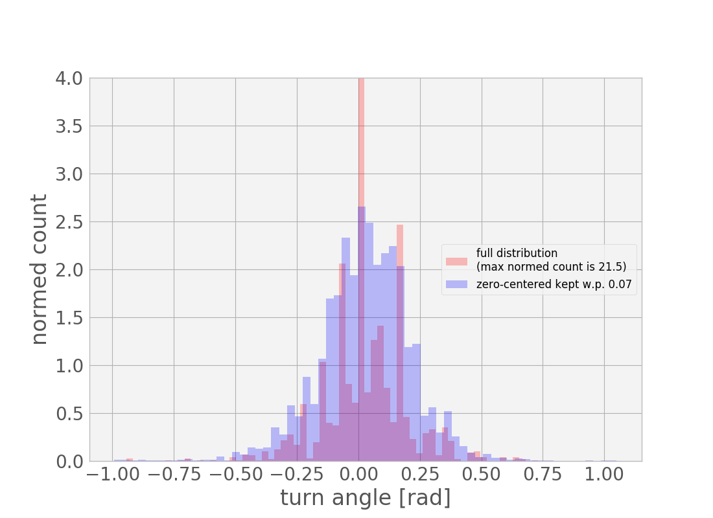

# Behavioral cloning for end-to-end learning of steering angle control from video

Tom Bertalan

## Architecture development and training method

Initially, I made a very small convnet of only a couple layers, just to get a pipeline established. This predictably performed pretty poorly, though I suspect that, with some of the many other modifications I subsequently made to the full pipeline, even this would have done reasonably well.

I used a MSE loss throughout, and predicted only steering angles.

The first modification I made was to the optimization method--I lowered the initial training rate significantly to 0.0001 since training loss (monitored in TensorBoard) was not progressing well. Subsequently, I used NAdam (Nesterov-Adam) to manage learning.

I next tried transfer learning, using a frozen InceptionV3 with the top (non-convolutional) layers replaced and retrained from scratch. However, because InceptionV3 provided a very large number of features (~49,000), almost all of my parameters (on the order of a million) were in the initial weight matrix to convert this to a much smaller first fully-connected layer. The number of trainable parameters therefore rose very quickly with the width of my fully connected layers, forcing me to pass the output from InceptionV3 through a very narrow bottleneck into whatever fully connected archicture I chose. This led to poor results coupled with slow training.

Instead, I dropped the transfer learning approach and adopted the network structure described in [1], which provides a fully-trainable convolutional architecture in only about half a million parameters. This architecture (tabulated below) provided much better performance and faster training.

Convolutional part provides 2,688 features.
_________________________________________________________________
Layer (type)                 Output Shape              Param #
=================================================================
input_1 (InputLayer)         (None, 160, 320, 3)       0
_________________________________________________________________
cropping2d_1 (Cropping2D)    (None, 90, 320, 3)        0
_________________________________________________________________
lambda_1 (Lambda)            (None, 90, 320, 3)        0
_________________________________________________________________
conv2d_1 (Conv2D)            (None, 43, 158, 24)       1824
_________________________________________________________________
conv2d_2 (Conv2D)            (None, 20, 77, 36)        21636
_________________________________________________________________
conv2d_3 (Conv2D)            (None, 6, 25, 48)         43248
_________________________________________________________________
conv2d_4 (Conv2D)            (None, 4, 23, 64)         27712
_________________________________________________________________
conv2d_5 (Conv2D)            (None, 2, 21, 64)         36928
_________________________________________________________________
flatten_1 (Flatten)          (None, 2688)              0
_________________________________________________________________
dense_1 (Dense)              (None, 100)               268900
_________________________________________________________________
dense_2 (Dense)              (None, 50)                5050
_________________________________________________________________
dense_3 (Dense)              (None, 10)                510
_________________________________________________________________
dense_4 (Dense)              (None, 1)                 11
=================================================================
Total params: 405,819
Trainable params: 405,819
Non-trainable params: 0
_________________________________________________________________

## Data, data augmentation, and preprocessing

Eventually, I found that very good results were obtainable using only the provided dataset. However, before realizing this, I gathered several datasets of up to four laps each driving in both directions around the main course, driving past problem areas, and driving on the alternate course (both on the centerline and in the right lane). 

In order to accomodate large datasets, I produced a `DataGenerator` class that worked with Keras's `Model.fit_generator` method to read images from the hard drive only as needed. Since Keras accumulates this data in a queue for feeding to to the optimizer, and batches appeared to be read from the generator initially faster than they were consumed by the optimizer, I do not believe that this was a bottleneck to training speed. This method also allows for combining several datasets gathered separately (each of which is stored as a zip file of the same structure as the provided data) into one mixed stream of training and validation data. Each dataset is extracted to temporary storage before training, and comprises a subdirectory full of `left_*.png`, `center_*.png`, and `right_*.png` images, as well as a CSV file in the top level listing paths to images with their corresponding response variable values (principally, steering angle).

Training/validation split is accomplished by marking the last 20% of each CSV file as validation data, concatenating all the files, and generating (for each epoch) a scrambled ordering. A random train/validation split cannot be used since it would result in training and validation samples close together in time, and therefore also close together in both input and response values.

### Response distribution leveling

One very important note for data collection is that continuous labels (obtained with mouse steering) worked much better than discrete (keyboard input). Even still, the actual range of mouse motion required was often very small, leading to single-pixel mouse movements that effectively quantize the response variable in shallow curves and on long straightaways. This might have been prevented with a larger window size (I used the minimum) or joystick input. The effect of this is visible in the steering-angle-vs-time plots below, in which the training/validation data flips rapidly between zero and nonzero values. The better control input is in fact more of an average of these.

This can also be observed in a histogram of the response values. In red is shown the distribution for a typical dataset, with a strong spike for the bin including 0 that extends beyond the top of the plot. If a histogram is generated such that the central bin contains only zero values (its symmetric left and right edges are set to just excluded the nearest non-zero value), and other bins of the same size are tiled across the remaining occupied domain, the average bin count in bins other than the central one is approximately 7% of the count in the central (zero)  bin.

With this realization, and the generator approach to producing training and validation data, I modified my data generation method to produce the histogram shown in blue. Specifically, when a row in the table was drawn with a zero associated turn angle, I rejected this row and drew another with probability 7%. This greatly enhanced the network's ability to detect and turn corners.

However, in addition to this data leveling, I applied weak l2 regularization to the weigthts of the network. Without the data leveling, this initially resulted in severe understeering, but with, this provided a much smoother response, closer to what likely would have been recorded initial with finer mouse control.

### Cropping and use of alternate camera angles

Since this particular architecture does not do any planning (unlike, perhaps, an LSTM), but only reacts to the present, I removed portions of the input irrelevant to this reaction task. This helps with consistency of the responses as well as makes better use of parameters, as the network does not need to dedicate filters to deciding features are irrelvant (trees, lakes, etc.).

A big boost was obtained by using the two provided off-center camera views to synthesize recovery data. Specifically, each steering angle was accompanied by a left, center, and right camera view. I produced a convential training pair from the center camera view and associated steering angle, but then supplemented this with two the additional views with the steering angle correspondingly decremented or incremented by a fixed value of `sidecamAdjustment`.

On the main track, training wiht `sidecamAdjustment` set to .9 results in sharp flailing (like a too-large `kp` on a proportional controller). Setting it to .01 results in running off the road. One way to determine the "correct" value would be to find the center image most similar to each side image, then choose the sidecamAdjustment value that brings the corresponding steering angles into closest agreement. This would depend on the measure of closeness--one possibility is to take a previously trained network, and forward-evaluate the final flattened feature vector after the convolutional layers. "Closest" could then be taken in the Euclidean sense in this space.

Another possibile approach is to observe the control actions suggested for a known smooth curve in the road--in this sequence of plots [doc/sidecamstrength], somewhere between .1 and .2 is the dividing line where the controller starts producing actual negative values rather than only zeros (corresponding to a lack of rightward turn torque, and therefore appropriate for maintaining a gentle rightward turn). I settled on TODO.
[figures from doc/sidecamstrength]

Interestingly, this insight provides most of what is needed to get some sort of results on the challenge track. There, much higher values of `sidecamAdjustment` are required to emphasie the much larger need for corrective steering when off centerline. Additionally, a lower target maximum speed helps, as well as a more aggressive back-off on speed when turning is detected (see postprocessing section below).

## Postprocessing

Initially, since network outputs appeared very noisy, I added temporal smoothing by using a running average of the last 6 or so steering angle predictions. Since this had the effect of damping out needed strong turns, I multiplied this average by an arbitrary scaling factor of about two. However, this approach predictably did more harm than good as the network outputs became better (thorugh improved architecture and preprocessing). In particular, temporal smoothing makes it difficult for the controller to respond to quickly changing inputs, as appear when the car is moving more quickly. With this smoothing in place, the speed had to be fixed at as low as 5 MPH to avoid curb strikes.

Eventually, the (unfiltered) network results were good enough to control the car reliably at its maximum speed of 30 MPH on straight sections, and almost this on curves. To accomodate this variability, I allowed the PI-controlled speed to have its set point reduced by the turn angle. This set point was then smoothed with a long-term running average of the past 60 set points or so before being passed to the speed controller. Obviously, it would be better to anticipate curves, and slow down in advance, but that would require a different model. This is at least a little better than a static speed.

## Other notes.

Discovered that training on just 10% of a smaller dataset (just `mouseForward.zip`), for only 1 epoch results in less overfitting and smoother driving. Combined with the dynamic speed control, this is very reliable. It also works passably using only the provided data.

Occasionally on the main track, and frequently on the challenge track, the wheels would lock up and the car would not move until the brakes were tapped manually, despite nonzero speed setpoint. This may have been bug in the physics, or may have been a bug in the PI controller (I have modified the controller to zero the integral term when brakes or gas is tapped, to short-circuit integral windup). I didn't investigate closely enough to determine.

## References

1. Bojarski, Del Testa, Dworakowski, Firner, Flepp, Goyal, Jackel, Monfort, Muller, Zhang J., Zhang, X., Zhao, & Zieba. (2016). End to End Learning for Self-Driving Cars. Retrieved from http://arxiv.org/abs/1604.07316